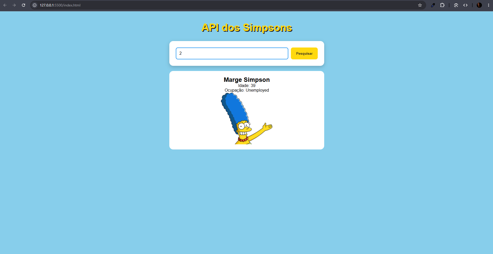
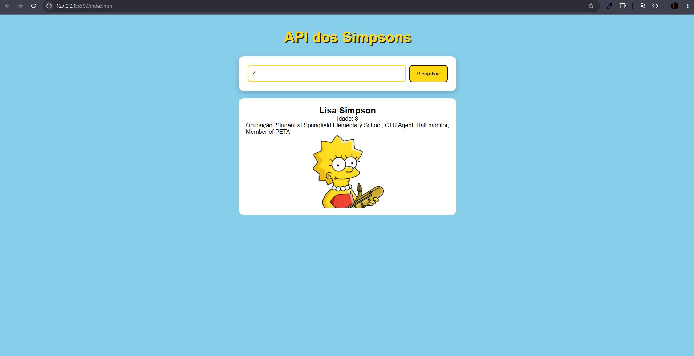

# API utilizada:
Decidimos utilizar a API referente a serie The Simpsons e achamos a seguinte Api utilizada.
*https://thesimpsonsapi.com*

# O que é desenvolvido:
Ao realizar a pesquisa todas as respostas são retornadas em formato JSON. Os seguintes campos são fornecidos ao realizar a pesquisa...
*id, age, aniversário, gênero, nome, ocupação, retrato, frase, status*

# Endereço chamado:
Uma pesquisa feita por exemplo pode retornar na seguinte url...
*https://thesimpsonsapi.com/api/characters*

# Como rodar:
Na aba de pesquisa digite uma numeração e aparecerá um dos personagens da série *The Simpsons*.

# Captura do sistema funcionando:
*Marge*

*Lisa*

# Dificuldade encontrada:
O principal desafio encntrado é por a API não possuir filtro de busca nativa por parâmetro do URL. 